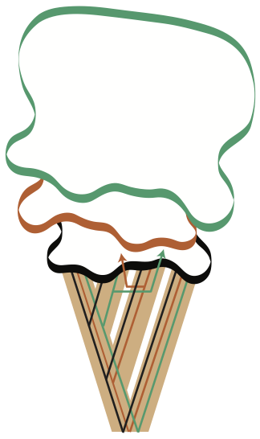

# Divergence-based Introgression Polarization (DIP)

Introgressive hybridization is an impactful evolutionary process. 
While there are many tools for identifying the presence of introgression, few explicitly determine the direction in which genetic material was transferred during introgression.
DIP is a tool for polarizing both unidirectional and asymmetric bidirectional introgression to determine the donor and recipient taxa.
DIP works in a widely-used four-taxon context and is built to analyze either whole-chromosome alignments or single-locus alignments spanning the genome.

## DIP References:
*Forsythe ES, Sloan DB, Beilstein MA. Divergence-based introgression polarization (Submitted). Available from: https://www.biorxiv.org/content/10.1101/539197v1*

*Forsythe ES, Nelson AD, Beilstein MA. Biased gene retention in the face of massive nuclear introgression obscures species relationships (Submitted). Available from: https://www.biorxiv.org/content/early/2018/10/18/197087?%3Fcollection=*

## Contents of this repository
This repository contains scripts for performing Divergence-based Introgression Polarization (DIP) analyses. 

## Dependencies
To run DIP, users will need to install R (v3.5.0) with the following R packages: phyclust (v0.1.22), parallel (v3.5.0), plyr (v1.8.4), seqinr (v3.4.5), reshape2 (v1.4.3), ggplot2 (v3.0.0), gplots (v3.0.1), RColorBrewer (v1.1.2), ape (v5.2). 
Note that the indicated versions are the versions used for testing DIP but we expect that DIP should run other under versions as well.

### *DIP.R*

DIP.R is used to perform 1x, 2x, and 3x-DIP analyses. 
DIP.R is called from the command line using the Rscript command.
The input data are single-gene multiple sequence alignments in fasta or phylip format.
DIP was designed for and tested on datasets composed of roughly 1000-10,000 single locus alignments.
Alignment files should be stored in the same directory. 
The path to this directory specified by the user when DIP.R is called.
The names of all alignment file should contain a common string, that is also specified by the user when DIP.R is called.
The taxon identifiers/sequence names should contain unique strings specifying the species name (e.g. SpeciesX_000000001, SpeciesY_000000001, etc...)
If there are more than four taxa in alignments, extra taxa are pruned to leave only the four taxa specified by the user.

*Running DIP.R*

DIP.R is called from the command line with nine arguments as follows:

`Rscript --vanilla DIP.R <A1:Jobname> <A2:type_of_alignment> <A3:directory_containing_alignments> <A4:Simlulation replicate> <A5:Total_number_of_taxa_in_alignments> <A6:P1_taxon_string> <A7:P2_taxon_string> <A8:P3_taxon_string> <A9:Outgroup_taxon_string>`

+ *<A1:Jobname>*

This should be used to specify a string that is common to all alignment file names

+ *A2:type_of_alignment*

The alignment type. Either "fasta" or "phylip"

+ *A3:directory_containing_alignments*

The full path to the directory containing the single-locus alignments. End with a "/"

+ *A4:Simulation_replicate*

This is only used for simulation analyses where the genome alignment step was replicated. For analysis of empirical data, make this the exact same string used in A1

+ *A5:Total_number_of_taxa_in_alignments*

The total number of taxa in each alignment. If this number varies, put the minimum number of taxa expected. Should be at least four.

+ *A6:P1_taxon_string*

A string found in the sequence identifiers of the species used as P1

+ *A7:P2_taxon_string*

A string found in the sequence identifiers of the species used as P2

+ *A8:P3_taxon_string*

A string found in the sequence identifiers of the species used as P3

+ *A9:Outgroup_taxon_string*

A string found in the sequence identifiers of the species used as the outgroup

Example command:

`Rscript --vanilla DIP.R "fa" "fasta" "DIP/Simulated_alignments/" "fa" "4" "s1" "s2" "s3" "o"`

*Running Make_locus_alignments.R*

If data are in the format of whole-chromosome alignments, DIP requires these large alignments to be divided into windows (similar to single-locus alignments).
Make_locus_alignments.R is used to split large alignments into smaller single-window alignments. This will work for a single chromosome alignment or it can iterate through alignments for multiple chromosomes.
At this time, alignments must be in fasta format.

*Running Make_locus_alignments.R*

Make_locus_alignments.R is called from the command line with nine arguments as follows:

`Rscript --vanilla Running Make_locus_alignments.R <A1:chrom_aln_dir> <A2:single_locus_aln_dir> <A3:alignment_file_pattern> <A4:Total_number_of_taxa_in_alignment> <A5:Window_length>`

+ *A1:chrom_aln_dir*

The directory in which the chromosome alignment(s) live

+ *A2:single_locus_aln_dir*

The directory where you want the window alignments to output. Make this directory on your own before running the script

+ *A3:alignment_file_pattern*

A string found in all chromosome alignments you'd like to analyze

+ *A4:Total_number_of_taxa_in_alignment*

The minimum number of taxa expected in each chromosome alignment file

+ *A5:Window_length*

The desired length of windows. We have been using 10,000 nt by default but this will depend on expected linkage disequilibrium in your system.

Example command:

`Rscript --vanilla Running Make_locus_alignments.R "DIP/Chrom_alignments/" "DIP/Chrom_alignments/windows" "fa" "4" "10000"`

